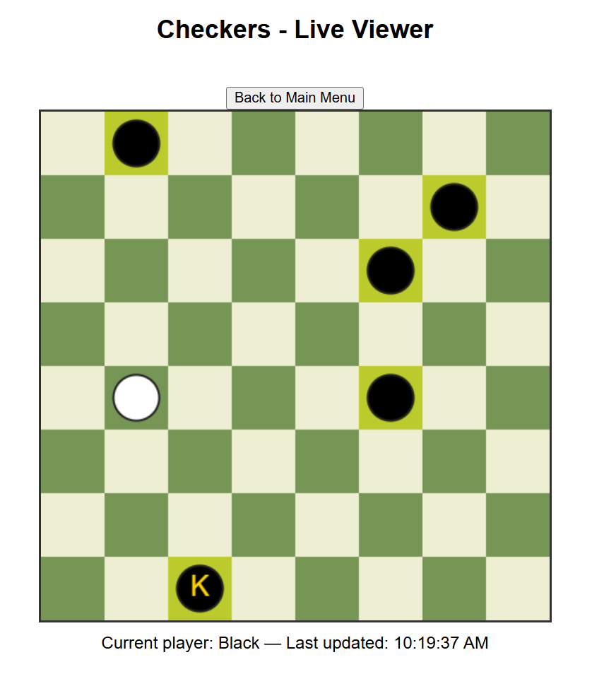

# Checkers AI with MCTS and Neural Networks
 
A deep reinforcement learning checkers AI built using Monte Carlo Tree Search (MCTS) and a neural network policy/value model. The AI can train through self-play or be played against by a human from a local website.

## The Algorithm

This project implements an AlphaZero-style reinforcement learning for checkers:

1. Self-Play with MCTS
    The AI plays games against itself using MCTS to explore possible move sequences.
    a. MCTS involves selecting the next state (after some move) with the highest ucb score. 
    b. That node (state) is then expanded, using the neural network to evaluate that position and nodes are added for all of the legal opponent moves.
    c. The information is backpropagated back to the root node.
    d. This cycle repeats for a certain number of simulations (50).

2. Policy & Value Network
    A PyTorch-based neural network predicts both the probability of each move (policy) and the expected game outcome (value).
    The MCTS output is used as a training target for the policy, while the actual game outcome trains the value prediction.

3. Training Loop
    Self-play games are stored as training examples.
    The model is updated in batches, improving move selection over time.

4. Human Play Mode
    You can play against the trained model through the local website.
    Moves and game state are synchronized using WebSockets. 

## Running this project

1. Start the WebSocket Server
    node server.js
2. Start the program
    python3 train.py
3. Visit the website 
    http://<Your-IP>:8080

[View a video explanation here](video link)